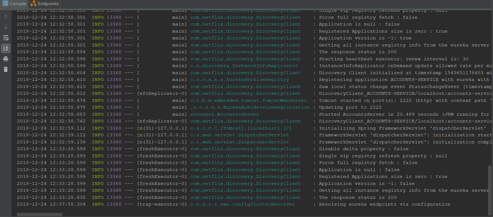
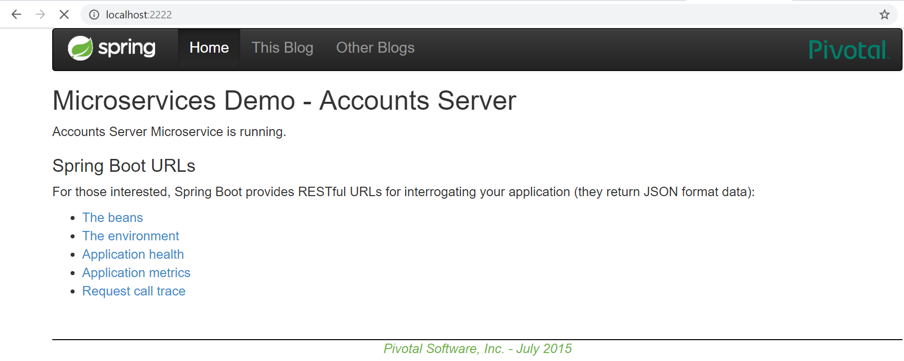
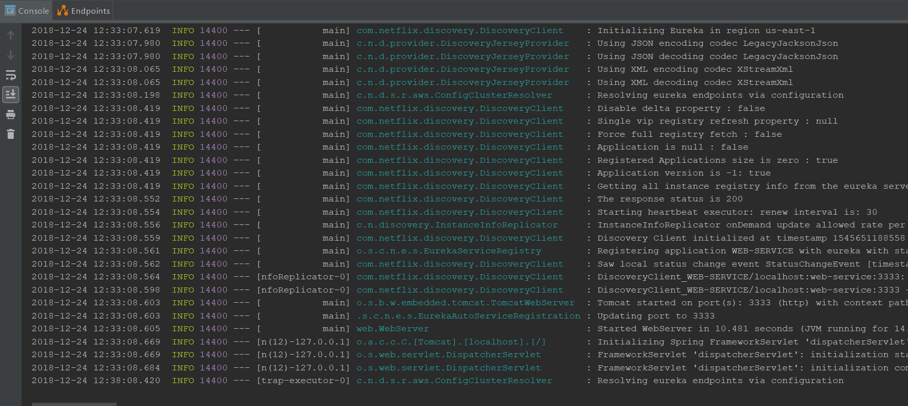
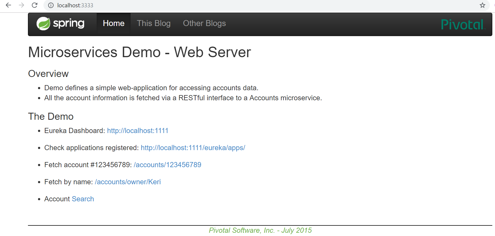
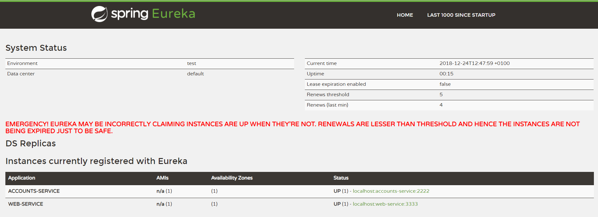
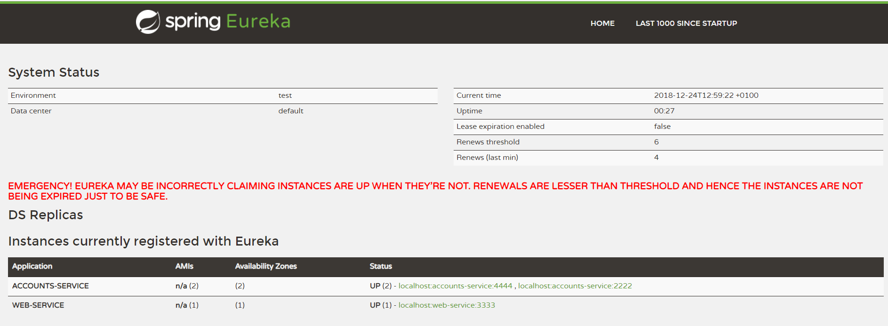
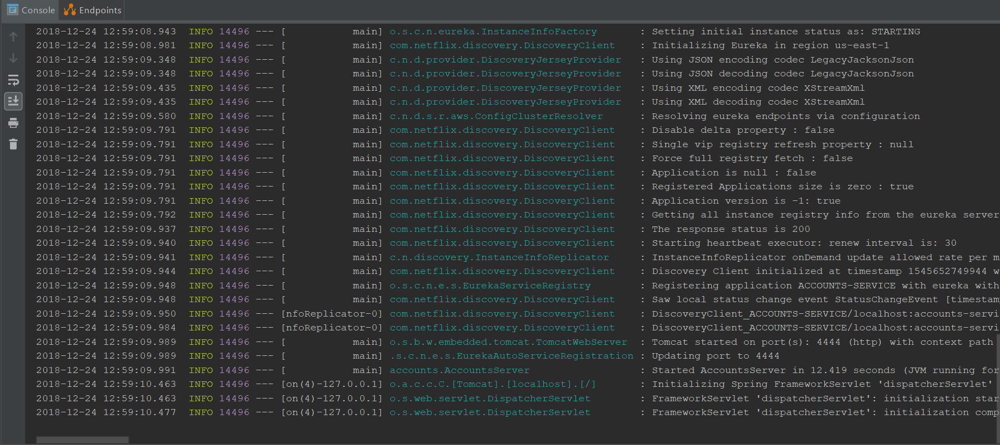
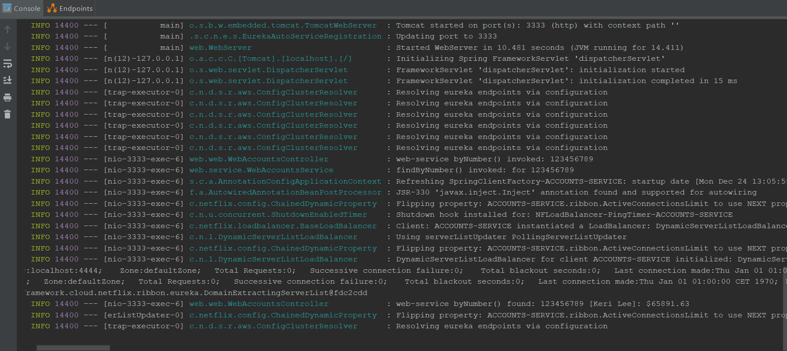

* **The two microservices are running and registered (two terminals, logs screenshots).**

1. Microservice account service.

1. Microservice web service.

* **The service registration service has the two microservices registered (a third terminal, dashboard screenshots)**
In the figure bellow it can be seen the two instances of both microservices.

* **A second account microservice is running in the port 4444 and it is registered (a fourth terminal, log screenshots).**
The new service can be run in 4444 changing the file [application.yml](accounts/src/main/resources/application.yml)

* **A brief report describing what happens when you kill the microservice with port 2222. Can the web service provide information about the accounts? Why?**
When the microservice in with the port 2222 is stopped and then it's tried to get information about some of the example accounts, the microservice switch is provider to the server 4444. It can be seen in the figure bellow:
